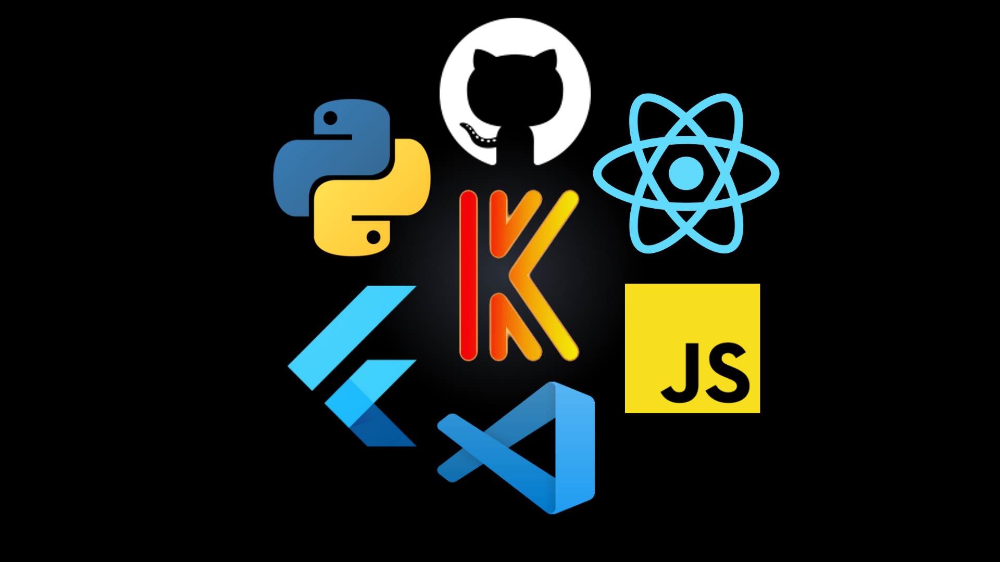
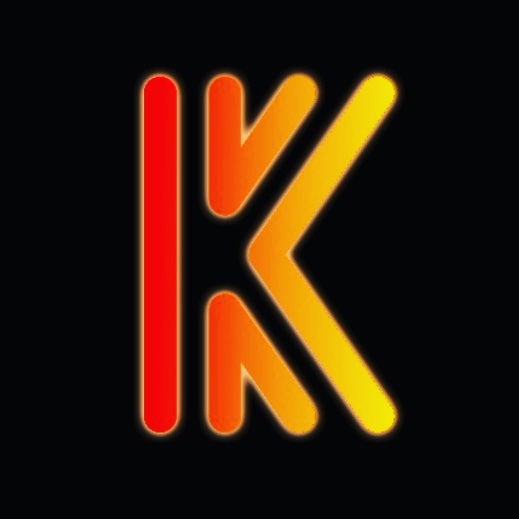
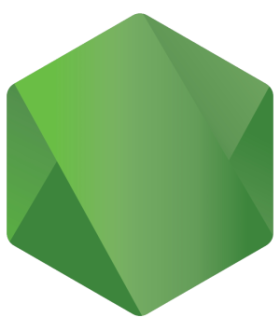
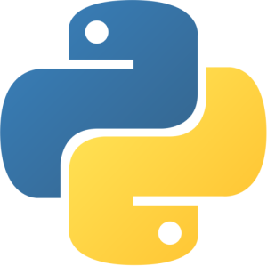

<!-- Background -->


<!-- Introduction -->
# () => console.log("Hello!"); 
Hi! My name is Kieran, I'm interested in technology, especially information technology and I ❤️ programming! I am inseparable from my laptop 💻 because I love to code 👨‍💻 or learn something new with it in my own free time ⏰. I always try to perfect 👌 the work that I do and aim for the highest quality possible ✨. I also genuinely enjoy teaching 📝 very much! Let's make the world 🌎 a better place, one piece of software at a time.

- 🧑🏻‍💻 Aspiring Software Engineer
- 🥬 Turning cabbage into commits
- ♠️ Ace Programmer Wannabe
- 💪 [Never give up](https://bit.ly/2XS3IU9) easily
- ⌨️ Average Typing Speed: 8️⃣4️⃣ wpm
- ⚡ Fun fact: I'm trilingual in both human and programming langauges
- 🎯 2021 Goals: Personal Projects

#### You Are Visitor Number


<!-- Stats -->
#  Hot Statistics 

<!--START_SECTION:waka-->
```text
HTML    2 hrs 14 mins   █████████████████████████   99.98 % 
```
<!--END_SECTION:waka-->

[](https://https://github.com/kspc100)

[](https://https://github.com/kspc100)


<!-- Tools & Technologies -->








<!---
kspc100/kspc100 is a ✨ special ✨ repository because its `README.md` (this file) appears on your GitHub profile.
You can click the Preview link to take a look at your changes.
- 👋 Hi, I’m Kieran Seah
- 👀 I’m interested in... programming of course! I like using javascript and python.
- 🌱 I’m currently learning ...
- 💞️ I’m looking to collaborate on ...
- 📫 How to reach me ...
--->
