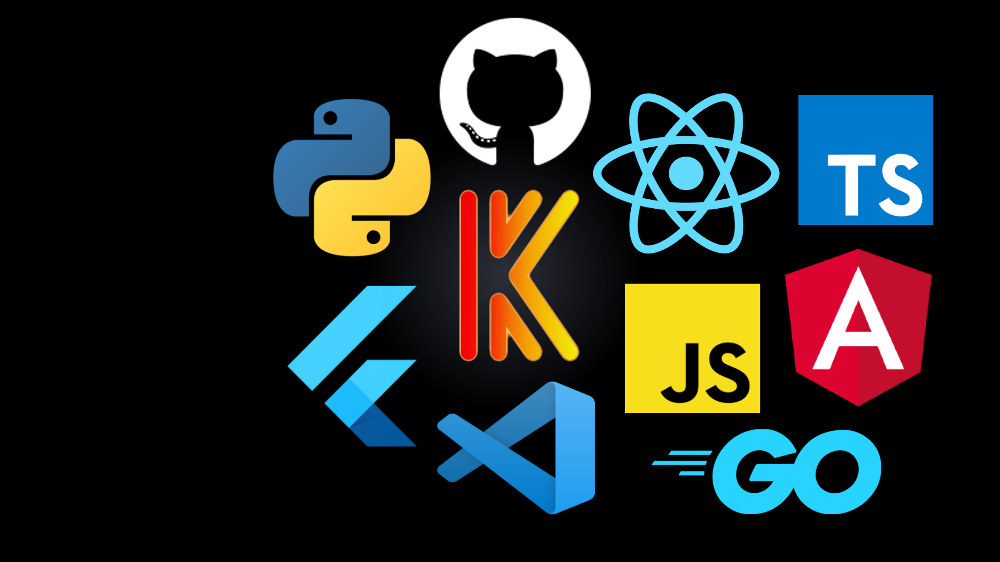
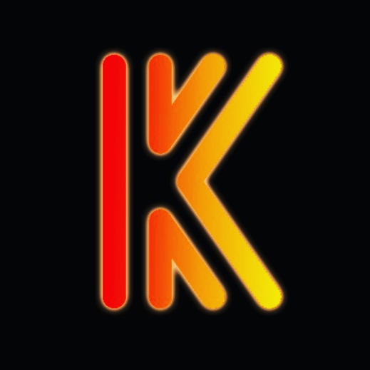
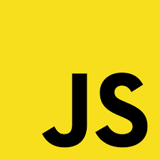
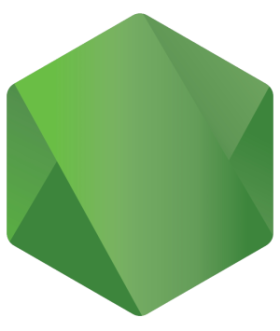
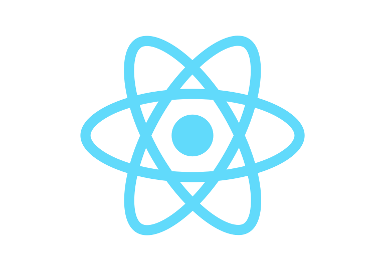
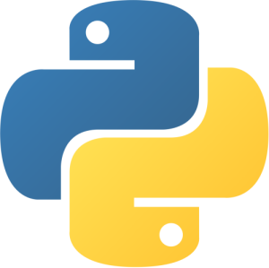
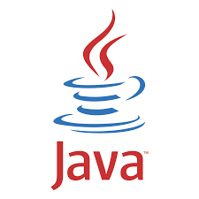
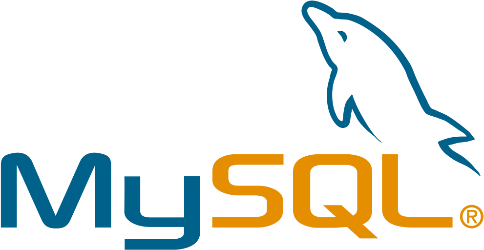
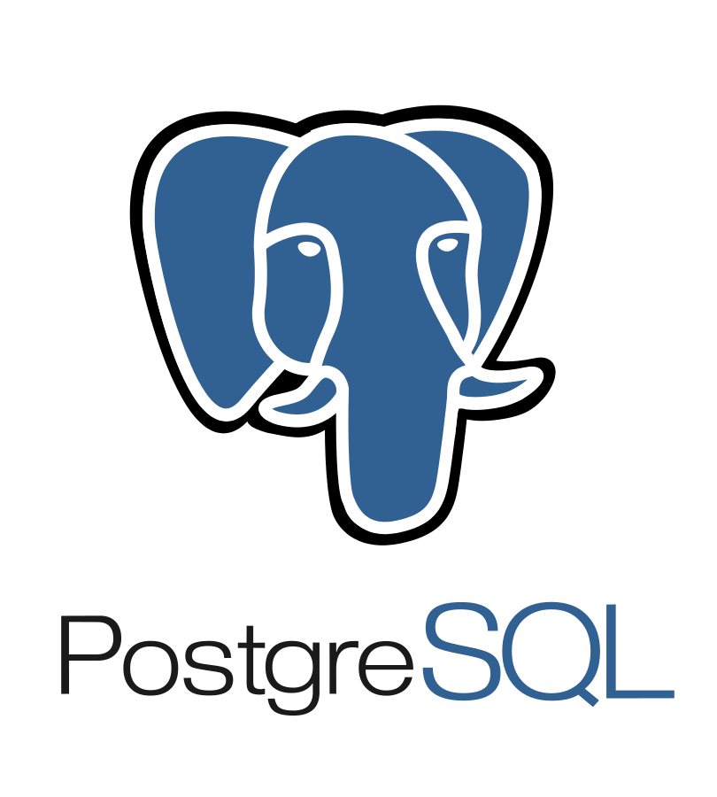

<!-- Background -->


<!-- Introduction -->
# () => console.log("Hello!");
Hi! I'm passionate about information technology and I ❤️ programming! I am inseparable from my laptop 💻 because I love to code 👨‍💻 or learn something new with it in my own free time ⏰. I always try to perfect 👌 the work that I do and aim for the highest quality possible ✨. I also genuinely enjoy teaching 📝 very much! Let's make the world 🌎 a better place, one piece of software at a time.

- 🧑🏻‍💻 Aspiring Software Engineer
- 🥬 Turning Cabbage into Commits
- 💪 [Never give up](https://bit.ly/2XS3IU9) easily
- ⌨️ Average Typing Speed: 💯 wpm
- 🎯 Constantly Improving Myself


<!-- Stats -->
# Code Statistics 

<!--START_SECTION:waka-->

```txt
Markdown   2 hrs 15 mins         ████████████████▓░░░░░░░░   66.24 %
HTML       1 hr 8 mins           ████████▒░░░░░░░░░░░░░░░░   33.76 %
```

<!--END_SECTION:waka-->

[](https://https://github.com/kspc1000)

[](https://git.io/streak-stats)

[](https://https://github.com/kspc1000)


<!-- Tools & Technologies -->
















<!---
kspc100/kspc100 is a ✨ special ✨ repository because its `README.md` (this file) appears on your GitHub profile.
You can click the Preview link to take a look at your changes.
- 👋 Hi, I’m Kieran Seah
- 👀 I’m interested in... programming of course! I like using javascript and python.
- 🌱 I’m currently learning ...
- 💞️ I’m looking to collaborate on ...
- 📫 How to reach me ...
--->
